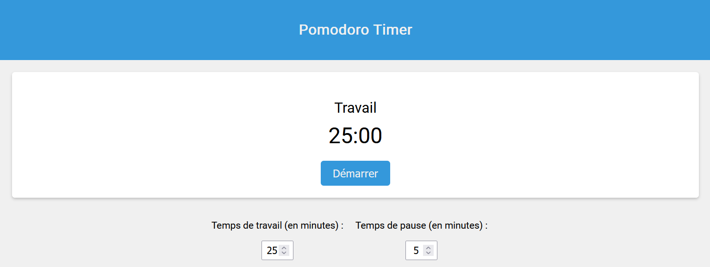

# Pomodoro Timer

Pomodoro Timer est une application web simple pour la gestion du temps basée sur la technique Pomodoro. Elle vous aide à rester concentré sur vos tâches en alternant entre des périodes de travail et de pause.

## Installation

Ouvrez le fichier `index.html` dans votre navigateur web.

## Utilisation

- Le temps de travail par défaut est de 25 minutes, mais vous pouvez le régler à l'aide du curseur.

- Le temps de pause par défaut est de 5 minutes, réglable également via le curseur.

- Cliquez sur le bouton "Démarrer" pour commencer le minutage.

- Pendant le travail, l'arrière-plan sera rouge.

- Pendant la pause, l'arrière-plan deviendra vert.

- Vous pouvez réinitialiser le minutage en cliquant sur le bouton "Réinitialiser".

## Aperçu

## Technologies utilisées

- HTML
- CSS
- JavaScript

## Remerciements

Je tiens à exprimer ma sincère gratitude envers les personnes suivantes pour leur précieuse contribution et leur soutien à ce projet :

- **Mr. Vallot** : Mon professeur, pour ses enseignements et ses conseils tout au long du développement de cette application.

- **Tom Leblais et Hugo Sefrioui** : Mes collègues, pour leur collaboration et leurs idées.
